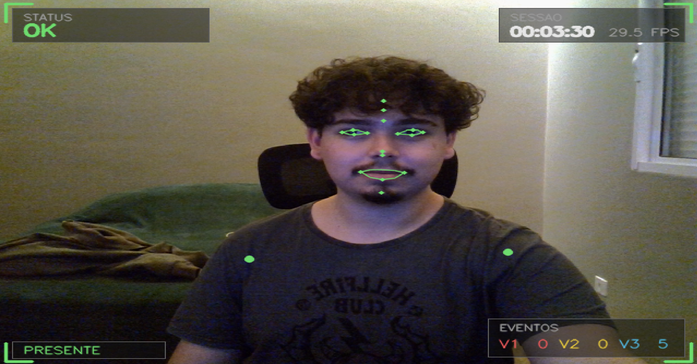
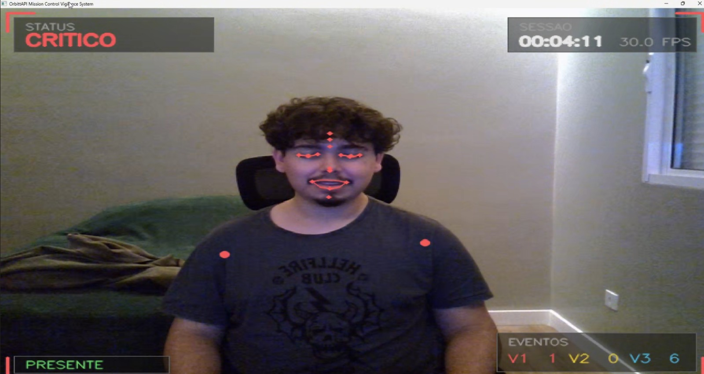
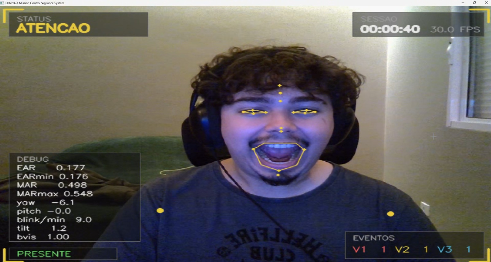
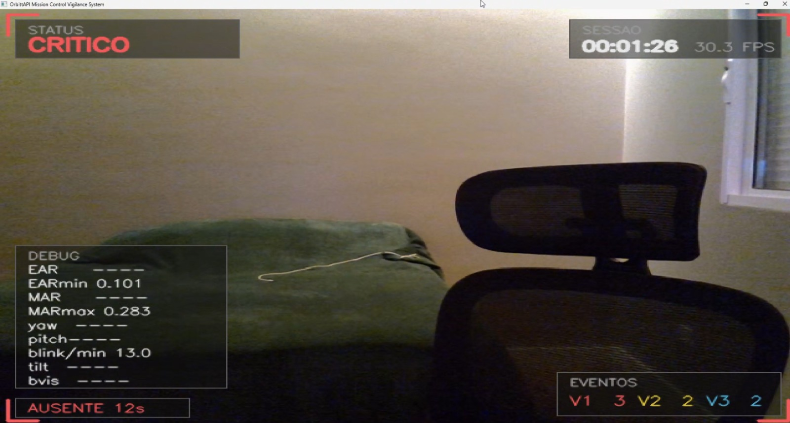
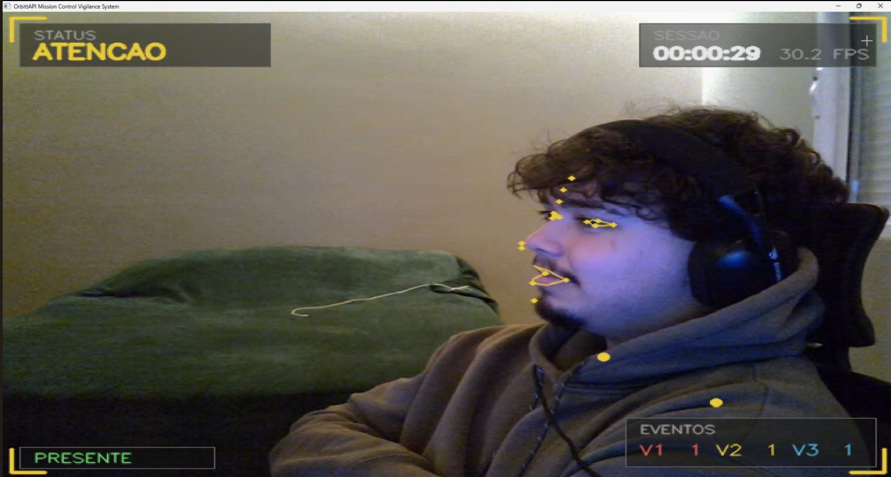
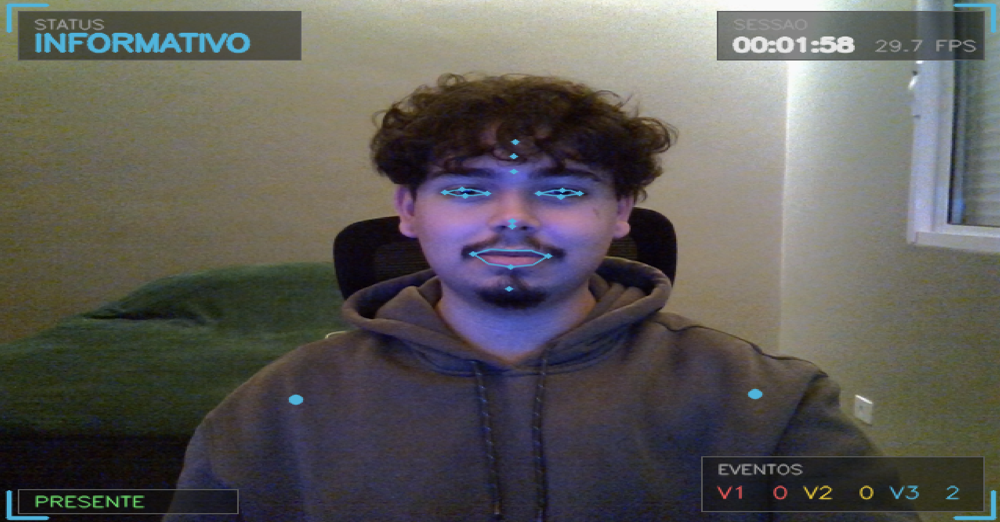
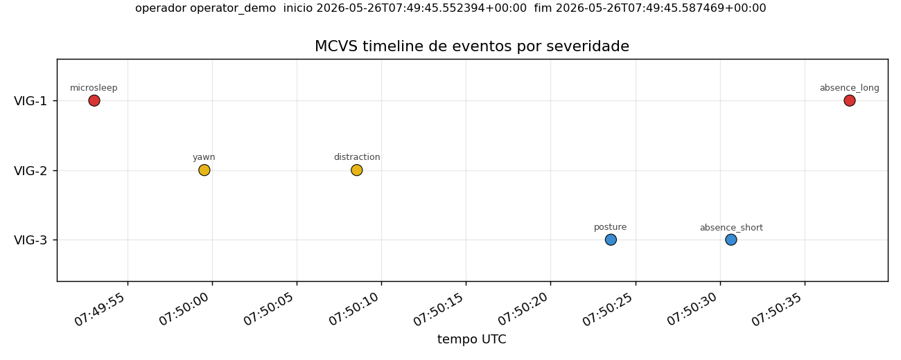

# OrbittAPI Mission Control Vigilance System

Entrega da disciplina **Physical Computing (IoT/IoB)** da Global Solution 2026.1 da FIAP. Sistema de visão computacional em Python que monitora em tempo real o estado físico de um operador de centro de controle através de uma webcam comum, sem hardware especializado.

## Descrição da solução

A frente da Global Solution do grupo é a **OrbittAPI**, plataforma SaaS de dados satelitais (NDVI, uso do solo, vegetação, alagamento, expansão urbana). Decisões agroambientais baseadas nesses dados (liberação de crédito agrícola, acionamento de seguro paramétrico, fiscalização ambiental) dependem de um analista interpretando dashboards o turno inteiro. Erro de leitura por fadiga ou distração gera decisões erradas em cascata.

O **Mission Control Vigilance System (MCVS)** observa esse analista pela webcam e classifica em tempo real seu estado em três níveis de severidade (VIG-1 crítico, VIG-2 atenção, VIG-3 informativo). A webcam atua como sensor IoB: extrai métricas do corpo humano sem invadir o operador (sem wearable, sem eletrodo).

**Detectores implementados (todos via MediaPipe + OpenCV):**

- **EAR (Eye Aspect Ratio)** — fadiga ocular e microsono
- **MAR (Mouth Aspect Ratio)** — bocejo sustentado
- **Head pose (yaw, pitch, roll via solvePnP)** — distração / olhar fora do monitor
- **Body pose (tilt de ombros, forward head)** — má postura
- **Presença** — operador deixou o posto
- **Taxa de blink** — anomalia de piscadas por minuto

Cada métrica passa por filtro de mediana móvel e uma engine de regras com **histerese** decide quando emitir evento. Eventos persistem em **SQLite** por sessão. O `replay_log.py` carrega a sessão e gera timeline matplotlib com resumo e recomendação textual.

## Bibliotecas utilizadas

| Biblioteca | Versão mínima | Para que serve |
|---|---|---|
| `opencv-python` | 4.9 | captura da webcam, desenho do HUD, solvePnP do head pose |
| `mediapipe` | 0.10.35 | Face Landmarker e Pose Landmarker (API tasks) |
| `numpy` | 1.26 | cálculos vetoriais de EAR, MAR, ângulos |
| `matplotlib` | 3.8 | timeline pós-sessão no replay_log |
| `rich` | 13.7 | formatação opcional de output no terminal |
| `sqlite3` | stdlib | persistência de eventos da sessão |

Tudo CPU-only, sem GPU, sem PyTorch ou TensorFlow custom.

## Instruções de execução

```bash
git clone https://github.com/Lynnbrosa/GS-IOTIOB.git
cd GS-IOTIOB

python -m venv venv

# Linux ou macOS
source venv/bin/activate

# Windows PowerShell
.\venv\Scripts\Activate.ps1

pip install -r requirements.txt
python main.py
```

Na primeira execução, o sistema baixa automaticamente dois arquivos de modelo do MediaPipe (~10MB total) para `data/models/` e cacheia para uso futuro.

A primeira linha de saída do programa é o caminho do SQLite gerado para a sessão.

### Atalhos durante a sessão

- `ESC` ou `q`: encerra a sessão
- `d`: liga e desliga o painel de DEBUG com EAR, MAR, ângulos, taxa de blink e visibilidade corporal

### Análise pós-sessão

```bash
python scripts/replay_log.py data/logs/session_YYYYMMDD_HHMMSS.db --output outputs/timeline.png
```

Gera resumo no terminal (contagem por severidade, duração em cada estado, recomendação textual) e timeline PNG.

### Calibração opcional

```bash
python scripts/calibrate_thresholds.py
```

Coleta 30s do operador em postura neutra e deriva thresholds personalizados para EAR, MAR e ângulos. Reduz falso positivo. Resultado salvo em `data/calibration.json` e carregado automaticamente.

## Demonstração visual

| Estado OK | Microsono VIG-1 | Bocejo VIG-2 |
|---|---|---|
|  |  |  |

| Ausência VIG-1 | Distração VIG-2 | Postura VIG-3 informativo |
|---|---|---|
|  |  |  |

Timeline da sessão gerada pelo `replay_log.py`:



## Estrutura

```
GS-IOTIOB/
├── main.py                      entry point
├── requirements.txt
├── src/                         pipeline de visão computacional
├── scripts/                     calibração e replay
├── data/                        modelos e logs (gitignored)
├── docs/                        arquitetura, thresholds, demo-script
└── outputs/                     screenshots e timeline de exemplo
```

Documentação técnica detalhada em [docs/arquitetura.md](docs/arquitetura.md) e [docs/thresholds.md](docs/thresholds.md).

## Vídeo demonstrativo

https://youtu.be/yIbtZp0yQNo

## Integrantes

- Giovanne Charelli Zaniboni Silva — RM 556223
- Leonardo Pasquini Baldaia — RM 557416
- Gustavo Oliveira de Moura — RM 555827
- Lynn Bueno Rosa — RM 551102
